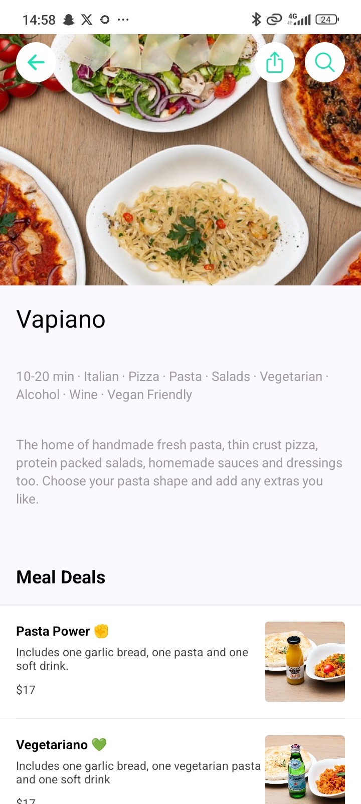

# React Native Delivery Clone 

This is a React Native Delivery app clone a user-friendly platform that connects customers with a variety of local restaurants, allowing them to browse menus, place orders, and track deliveries in real time. This app was inspired by the [Deliveroo](https://deliveroo.co.uk/) app.

Additional features:

- [Expo Router](https://docs.expo.dev/routing/introduction/) file-based navigation and API Routes
- [Reanimated](https://docs.swmansion.com/react-native-reanimated/) 3 for animations
- [Gesture Handler](https://docs.swmansion.com/react-native-gesture-handler/) for gestures
- [Zustand](https://zustand-demo.pmnd.rs/) for state management

## Screenshots

<!-- 
## Demo

<!-- 

 --> # React Native Delivery Clone 

